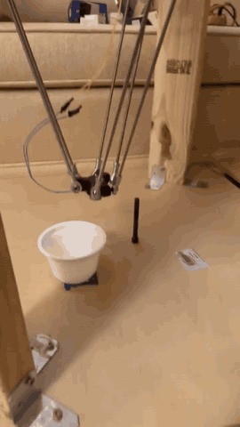
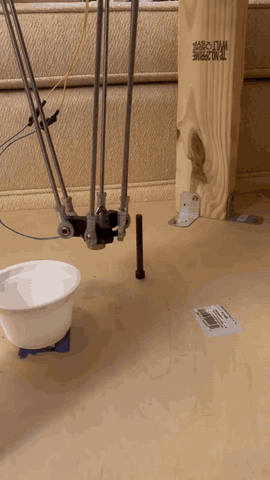
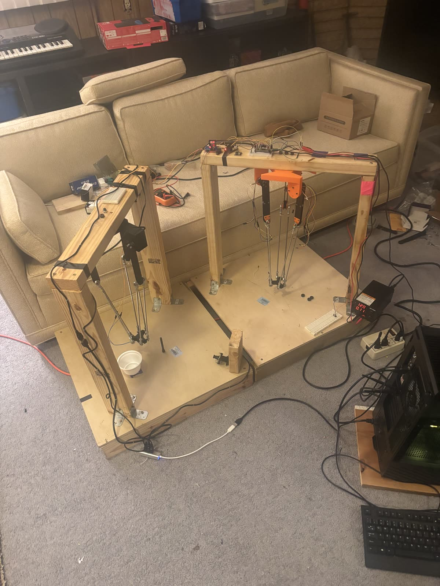
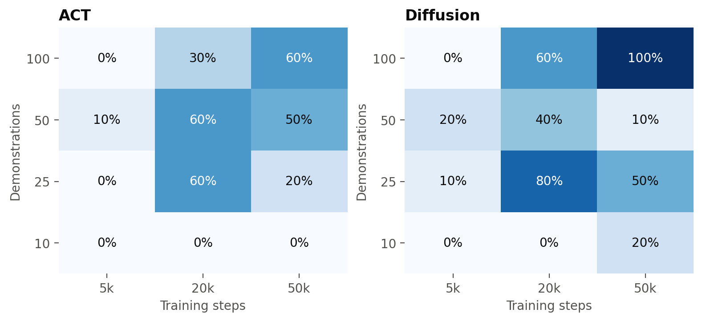

# ACT vs. Diffusion Policy on a Home-Built Delta Robot

**A real-robot comparison of the two most widely used imitation-learning policies, scaled across
training data (10–100 demonstrations) and training length (5k–50k steps), on a 3-DOF delta robot
with an electromagnet gripper. Everything is open: CAD, firmware, recording and evaluation code,
the 100-episode LeRobot dataset, 240 scored real-world trials, and the two best checkpoints.**

<p align="center">
  
  &nbsp;&nbsp;
  
  <br>
  <sub>The two published models, fully autonomous, 2× speed, both trained on 100 demos for 50k steps and recorded after
  the study. Left: Diffusion Policy v2 (10/10 in scoring), RTX 3090. Right: ACT (6/10 in scoring), laptop CPU.
  Full-resolution clips: <a href="media/diffusion_best_n100_s50k.mp4">left</a>, <a href="media/act_best_n100_s50k.mp4">right</a>.
  Runs filmed during evaluation: <a href="media/diffusion_n25_s20k.mp4">Diffusion 25 demos / 20k</a>,
  <a href="media/act_n50_s20k.mp4">ACT 50 demos / 20k</a>.</sub>
</p>

<p align="center">
  
  <br>
  <sub>The two robots. Left: the servo-driven follower that the policies control. Right: the leader arm, moved by hand
  during teleoperation, with a magnetic encoder at each shoulder.
  More photos: <a href="hardware/photos.md">hardware/photos.md</a>.</sub>
</p>

The task: find a steel bolt standing on the table, pick it up with the electromagnet, carry it to
a cup and drop it in. The policy sees three 320×240 USB cameras and outputs joint angles plus a
magnet on/off command at 30 Hz. There is no hand-written motion planning.

| | |
|---|---|
| Robot | 3-DOF delta robot, 3× Feetech STS3215 (12 V) servos, Teensy 4.1, electromagnet end effector |
| Teleoperation | Leader–follower: a second, hand-moved delta arm with 3× AS5600 magnetic encoders that the follower mirrors |
| Dataset | 100 demonstrations, 33,200 frames, 30 fps, 3 RGB cameras, LeRobot v3.0 format |
| Policies | ACT and Diffusion Policy, LeRobot 0.5.0 |
| Grid | {10, 25, 50, 100} demos × {5k, 20k, 50k} steps × 2 policies = 24 models |
| Evaluation | 10 real-robot trials per model (5 bolt positions × 2), **240 scored trials** |

📄 **Paper: [PDF](paper/ACT_vs_Diffusion_in_Delta_Robots_for_Simple_Pick_and_Place_Training.pdf)** (LaTeX source in [`paper/`](paper/)) · Markdown version: [REPORT.md](REPORT.md)

## Results at a glance

Success = the bolt ends up in the cup. 10 trials per cell.

| Demos | ACT 5k | ACT 20k | ACT 50k | Diffusion* 5k | Diffusion* 20k | Diffusion* 50k |
|---:|:---:|:---:|:---:|:---:|:---:|:---:|
| 10 | 0 | 0 | 0 | 0 | 0 | 2 |
| 25 | 0 | 6 | 2 | 1 | **8** | 5 |
| 50 | 1 | 6 | 5 | 2 | 4 | 1 |
| 100 | 0 | 3 | **6** | 0 | 6 | **10** |

<sub>*Diffusion Policy with four changes from LeRobot's defaults. The defaults did not work on this robot; see the first finding below.</sub>

<p align="center"></p>

**Findings**

1. **Out of the box, LeRobot's Diffusion Policy never left the start pose.** With leader–follower
   teleoperation data, "next action ≈ current joint state" is almost exactly true. The default
   Diffusion setup (vision encoder trained from scratch, no crop augmentation, 2 observation frames,
   a 0.53 s horizon) learned to copy its own joint readings instead of looking at the cameras. Offline
   input-ablation tests showed this. Four changes fixed it: an ImageNet-pretrained ResNet-18, random crops,
   the joint-state input **blinded** (zeroed), and a 1.6 s action horizon. ACT, with its defaults, did
   not have this problem. If you train on leader–follower data, check for this shortcut.
2. **The best model was the fixed Diffusion Policy with 100 demos and 50k steps: 10/10**, every
   bolt position, every time on the first grab. Subjectively it was also the most impressive
   policy in the study. The operator's note was "just crushed it."
3. **Below about 20k steps or 25 demos, almost nothing works.** At 5k steps the two policies went 4/80
   combined, and with 10 demos 2/60.
4. **ACT improves steadily with more data** at 50k steps: 0 → 2 → 5 → 6 of 10 for 10/25/50/100 demos
   (trend p = 0.0015).
5. **There is no statistically significant overall winner.** Pooled over all 12 cells, Diffusion went
   39/120 and ACT 29/120 (Fisher p = 0.20). The two policies failed differently: ACT mostly knocked the
   bolt over (an aggressive grab); Diffusion mostly stalled (hesitation).
6. **ACT is the practical choice when speed matters.** It plans a 100-action chunk in about 0.1–0.4 s on a
   laptop CPU and runs in real time. Diffusion with 100 denoising steps needs about 0.76 s per
   24-action plan on an RTX 3090 (the robot pauses to think), and about 18 s on a laptop CPU.

Caveats: 10 trials per cell gives wide confidence intervals, and ACT and Diffusion were evaluated on
different machines on different days. [REPORT.md](REPORT.md) covers this in full.

## Models and dataset (Hugging Face)

| | Link | Trials | Notes |
|---|---|---|---|
| Dataset | [`KirkHaskell/delta_robot_bolt_pick_place`](https://huggingface.co/datasets/KirkHaskell/delta_robot_bolt_pick_place) | — | 100 episodes, LeRobot v3.0, 3 cameras, ~600 MB |
| Best Diffusion | [`KirkHaskell/diffusion_delta_robot_bolt_pick_place`](https://huggingface.co/KirkHaskell/diffusion_delta_robot_bolt_pick_place) | 10/10 | 100 demos, 50k steps; needs a GPU for real-time use |
| Best ACT | [`KirkHaskell/act_delta_robot_bolt_pick_place`](https://huggingface.co/KirkHaskell/act_delta_robot_bolt_pick_place) | 6/10 | 100 demos, 50k steps; runs on a laptop CPU |

The other 22 checkpoints (about 15 GB for the final checkpoints, about 250 GB with intermediate
checkpoints) are not published. Open an issue if you need one.

## What's in this repo

| Path | Contents |
|---|---|
| [`paper/`](paper/) | LaTeX source of the paper, its references and vector figures (`analysis/make_paper_figures.py`) |
| [`hardware/`](hardware/) | STL files for the printed parts and the Onshape assembly export (URDF + glTF meshes) |
| [`firmware/`](firmware/) | Teensy 4.1 firmware: leader–follower teleoperation, autonomous mode, electromagnet control |
| [`robot/`](robot/) | Record demonstrations, run a policy on the robot, scored evaluation sessions, camera and hardware checks (Windows + Linux) |
| [`training/`](training/) | Training queue for the whole grid, plus a LeRobot 0.5.0 wrapper (subset-sampler bug fix and joint-state blinding) |
| [`analysis/`](analysis/) | Results statistics and figures, the "copycat" diagnostic, DDIM-vs-DDPM check |
| [`results/`](results/) | All 240 trials, per-model summary, statistics, training-loss curves, ACT run traces |
| [`figures/`](figures/) | Plots used in the report |
| [`media/`](media/) | Robot videos and three example demonstrations (all three cameras side by side) |
| [`tools/`](tools/) | `render_episode.py`: turn any episode into a side-by-side video |

Example demonstrations from the dataset (left to right: `side`, `top_right`, `top_left`):
[episode 1](media/demos/episode_001.mp4) · [episode 42](media/demos/episode_042.mp4) · [episode 91](media/demos/episode_091.mp4)

## Quick start

Python 3.12 is recommended. Install PyTorch for your machine first (see pytorch.org), then:

```bash
git clone https://github.com/KirkEHaskell/delta-robot-act-vs-diffusion
cd delta-robot-act-vs-diffusion
pip install -r requirements.txt
```

**Download the dataset and the models**

```bash
hf download --repo-type dataset KirkHaskell/delta_robot_bolt_pick_place --local-dir data/delta_robot_bolt_pick_place
hf download KirkHaskell/act_delta_robot_bolt_pick_place --local-dir models/act
hf download KirkHaskell/diffusion_delta_robot_bolt_pick_place --local-dir models/diffusion
```

**Look at a demonstration** (needs ffmpeg)

```bash
python tools/render_episode.py --root data/delta_robot_bolt_pick_place --episode 42 --out episode_042.mp4
```

**Run a model on the robot** (from inside `robot/`, with the Teensy flashed and the cameras mapped; see [Building your own](#building-your-own))

```bash
cd robot
python teensy_check.py
python run_policy.py dry --ckpt ../models/act
python run_policy.py try --ckpt ../models/act
```

`dry` runs the model on live inputs and prints its actions without moving the robot. `try` runs it
for real: Enter starts a run and Space stops it. Diffusion: add `TC_SCHED=DDIM TC_STEPS=10` on a
CPU-only machine (much slower, but it works). The joint-state blinding the Diffusion model needs is
applied automatically.

**Train your own**

```bash
python training/run_grid.py --console          # the full ACT grid + default Diffusion (v1)
python training/run_grid.py --v2 --console     # the fixed Diffusion grid (v2)
```

Or train a single model with the same settings as the best Diffusion model:

```bash
BLIND_STATE=1 python training/lerobot_train_fixed.py \
  --dataset.repo_id=local/delta_robot_bolt_pick_place --dataset.root=data/delta_robot_bolt_pick_place \
  --dataset.video_backend=pyav --policy.type=diffusion --policy.push_to_hub=false \
  --policy.pretrained_backbone_weights=ResNet18_Weights.IMAGENET1K_V1 --policy.use_group_norm=false \
  "--policy.crop_shape=[216, 288]" --policy.crop_is_random=true --policy.n_obs_steps=1 \
  --policy.horizon=48 --policy.n_action_steps=24 --policy.drop_n_last_frames=24 \
  --batch_size=32 --seed=1000 --steps=50000 --output_dir=outputs/diffusion_v2_n100
```

For ACT, use `--policy.type=act` and drop the Diffusion-specific flags and `BLIND_STATE`. Training
used one RTX 3090. Expect about 3 h for 50k steps of either policy at batch size 32.

## Building your own

This repo is not a step-by-step build guide, but everything needed to reproduce the robot is here:

- **Printed parts:** [`hardware/stl/`](hardware/stl/) (base, upper arms, end effector with electromagnet
  mount, camera holders). [`hardware/onshape_export/`](hardware/onshape_export/) has the full assembly
  as URDF + glTF.
- **Electronics:**
  - Teensy 4.1
  - 3× Feetech STS3215 servos on a 1 Mbit/s bus (Teensy `Serial1`, servo IDs 2, 3, 1)
  - 3× AS5600 magnetic encoders on the leader arm (two hardware I²C buses + one bit-banged bus)
  - an electromagnet driven through an H-bridge (pins 30/32)
  - a push button for the magnet during teleoperation (pins 4/5)
  - 3× Innomaker U20CAM-720P USB cameras on a USB hub

  Pin assignments and calibration constants are at the top of
  [`firmware/delta_teleop/delta_teleop.ino`](firmware/delta_teleop/delta_teleop.ino).
- **Software setup:**
  1. Flash the firmware. Calibrate the encoders with the `d` debug command, as described in the
     firmware comments.
  2. Map each camera's USB port to its role in `robot/cameras_windows.py` or `robot/cameras_linux.py`.
     Run that file to list the ports.
  3. Check everything with `python robot/teensy_check.py` and `python robot/view_cameras.py`.
  4. Record demonstrations with `python robot/record_demos.py --root ../data/my_dataset`.
- **Serial protocol** (USB, 115200 baud):

  | Command | Meaning |
  |---|---|
  | `s` | Record/teleop mode |
  | `a` | Autonomous mode |
  | `c,j1,j2,j3,magnet` | Move command (autonomous mode) |
  | `x` | Stop |
  | `d` | Debug dump |

  The Teensy streams `millis,leader×3,follower×3,magnet` at 60 Hz. Joint angles are in degrees,
  clamped to 30–110°.

**Will the published checkpoints work on my robot?** Probably not without fine-tuning. They are tied
to this exact camera placement, table, lighting and camera colour settings. Treat them as a
reference point and as a starting point for fine-tuning on your own demos. The dataset and code are
the reusable parts.

**Camera colour:** in all of the training data, the `side` and `top_right` cameras have a
yellow-green cast. An old OpenCV script had turned auto white balance off and fixed the exposure,
and Windows kept those settings. The models expect this. On Linux, `run_policy.py` reproduces it
through V4L2 controls. For your own data, record with the cameras on auto
(`TC_MATCH_TRAINING_CAMERAS=0`).

## Lessons learned

- **Check that your policy actually uses the cameras.** [`analysis/diag_copycat.py`](analysis/diag_copycat.py)
  replays demos with the joint state frozen, then with the images frozen. A healthy policy
  reproduces the motion from images alone; a "copycat" doesn't. Low validation loss does not detect
  this.
- **Training loss predicts nothing here.** Fewer demos always gave lower loss (memorization) and
  worse robot performance.
- **LeRobot 0.5.x moved normalization out of the policy.** At inference you must load the
  checkpoint's pre/post-processors (`make_pre_post_processors`). Otherwise the actions come out
  normalized, and the arm drives into a joint limit.
- **LeRobot 0.5.0 bug:** Diffusion training with `--dataset.episodes` crashes, or silently reads the
  wrong frames. `training/lerobot_train_fixed.py` patches the sampler.
- **Three USB cameras on one hub need MJPG.** OpenCV on Windows silently falls back to uncompressed
  YUY2 and starves the third camera. Capture with PyAV and force MJPG.

## Citation

```bibtex
@misc{delta_act_vs_diffusion_2026,
  title  = {ACT vs. Diffusion Policy on a Home-Built Delta Robot: Data and Training-Length Scaling for Real-World Pick-and-Place},
  author = {Kirk Haskell},
  year   = {2026},
  url    = {https://github.com/KirkEHaskell/delta-robot-act-vs-diffusion}
}
```

## License

- **Code and firmware:** [MIT](LICENSE)
- **Dataset, CAD files, videos and figures:** [CC BY 4.0](LICENSE-DATA.md).
  Free to use, including commercially and for training models, with attribution.

Built with [LeRobot](https://github.com/huggingface/lerobot). The policies are
[ACT](https://arxiv.org/abs/2304.13705) (Zhao et al., 2023) and
[Diffusion Policy](https://arxiv.org/abs/2303.04137) (Chi et al., 2023).
