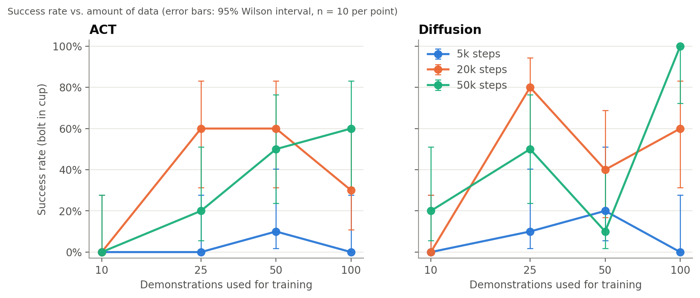
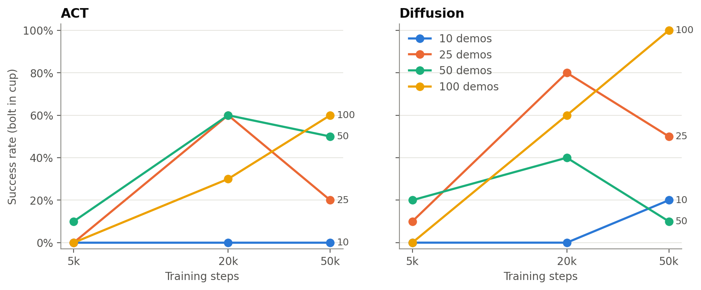
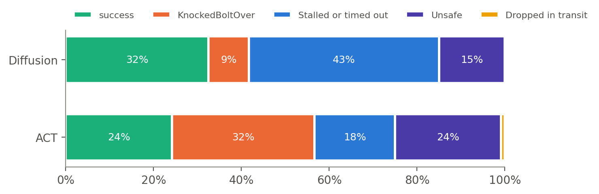
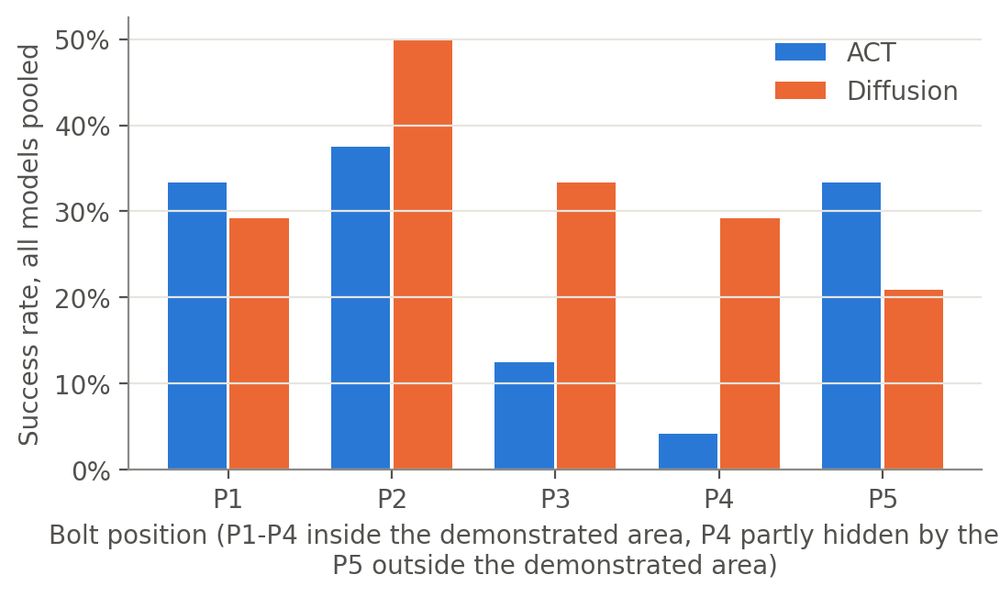

# ACT vs. Diffusion Policy on a Home-Built Delta Robot: Data and Training-Length Scaling for Real-World Pick-and-Place

**Kirk Haskell** · October 2026 · Code, CAD, data and models: <https://github.com/KirkEHaskell/delta-robot-act-vs-diffusion>

---

## Abstract

We trained imitation-learning policies for a 3-DOF delta robot with an electromagnet gripper. The
task is to pick up a standing bolt and drop it into a cup. We compared **ACT** (Action Chunking with
Transformers) and **Diffusion Policy** along two axes: the amount of training data (10, 25, 50 or 100
teleoperated demonstrations) and the training length (5k, 20k or 50k optimizer steps). That is 24
models in total, each scored on 10 real-robot trials (240 trials).

Out of the box, LeRobot's default Diffusion Policy **did not move**. It had learned to copy the
robot's own joint state rather than use its cameras, a shortcut that leader–follower teleoperation
data makes very attractive. We diagnosed this with offline input-ablation tests and fixed it with
four changes:

- an ImageNet-pretrained vision encoder
- random-crop augmentation
- the joint-state input blinded (zeroed)
- a 1.6 s action horizon

With these changes, the best model, **Diffusion Policy with 100 demos and 50k steps, succeeded on
10/10 trials**. The best ACT models reached 6/10.

Both policies essentially failed with 10 demonstrations or with 5k training steps. ACT showed a
clean data-scaling trend at 50k steps (0 → 20 → 50 → 60%). Pooled over the grid, Diffusion succeeded
on 33% of trials and ACT on 24%, a difference that is not statistically significant (p = 0.20). The
two policies failed in different ways: ACT mostly knocked the bolt over, while Diffusion mostly
stalled. ACT ran in real time on a laptop CPU, while Diffusion needed a desktop GPU and paused while
planning.

---

## 1. Introduction

Imitation learning from teleoperated demonstrations is now the standard way to teach low-cost robot
arms manipulation skills. Two policy classes dominate open-source practice: ACT [1] and Diffusion
Policy [2], both implemented in Hugging Face's LeRobot library [3]. People adopting them face two
practical questions:

1. **How many demonstrations do I need?**
2. **How long should I train?**

Published comparisons mostly use standard arms (ALOHA, Franka, SO-100) and report a single
data/compute setting. This study measures a full 4 × 3 grid of data and training length for both
policies on a physically different robot, a **delta (parallel) robot**. It scores every model on the
real robot under a fixed protocol.

**Contributions**

- A controlled real-robot grid: 2 policies × 4 data sizes × 3 training lengths, 240 scored trials,
  with the raw trial log, statistics and code to regenerate every number.
- A documented failure mode: default Diffusion Policy learns a **proprioception "copycat" shortcut**
  from leader–follower data. The report gives an offline diagnostic for it and a fix.
- An open dataset (100 demonstrations, 3 cameras, LeRobot v3.0) for a delta robot with a binary
  magnetic gripper, an embodiment that is rare in public robot-learning datasets.
- Open hardware (STL/URDF), firmware, and recording/evaluation software.

## 2. System

### 2.1 Robot

- **Arm:** a 3-DOF delta robot. Three printed upper arms are driven by **Feetech STS3215** serial-bus
  servos, and steel parallelogram rods with ball joints connect them to the end effector.
- **End effector:** an electromagnet (~12 V) switched through an H-bridge, which lifts the steel bolt.
- **Controller:** a **Teensy 4.1** talks to the servos over a 1 Mbit/s half-duplex bus.
- **Joint limits:** commands are clamped to 30–110°.

Joint angles are reported in degrees. The firmware, 3D-printed parts and the Onshape assembly
(URDF + meshes) are in `firmware/` and `hardware/`.

### 2.2 Teleoperation

Demonstrations were collected **leader–follower**. The operator moves a passive leader arm whose
three joints carry **AS5600** magnetic encoders, and the Teensy drives the follower servos to the
same angles in real time. A push button on the leader switches the magnet. The Teensy streams
`(leader angles, follower angles, magnet state)` at 60 Hz, and the recorder samples it at 30 Hz.

### 2.3 Cameras

The robot uses three **Innomaker U20CAM-720P** USB cameras: `side`, `top_right` and `top_left`.
All three are captured at 320×240, 30 fps, MJPG. Two practical details mattered:

- **Bandwidth.** Three uncompressed (YUY2) streams saturate one USB hub. OpenCV's Windows backend
  cannot force MJPG, so capture goes through PyAV/ffmpeg with MJPG forced. Cameras are addressed by
  physical USB port rather than OS index, because the indices reshuffle on replug and all three
  cameras share one serial number.
- **Colour cast.** In all recorded data, `side` and `top_right` have a strong yellow-green cast. An
  old OpenCV script had disabled auto white balance (left at 4600 K) and fixed the exposure at
  2⁻⁶ s, and Windows persisted those settings per device. `top_left` ran on auto. The cast is
  constant across the dataset. For evaluation on Linux it was reproduced exactly through V4L2
  controls (`robot/cameras_linux.py`), verified by matching luma and chroma statistics against the
  training video.

## 3. Dataset

| Property | Value |
|---|---|
| Episodes / frames | 100 / 33,200 at 30 fps |
| Episode length | 8.1–17.3 s (median 10.7 s) |
| Observation | `observation.state` = 3 follower joint angles (deg); 3 RGB images, 240×320 |
| Action | 4-D: leader joint angles j1–j3 (deg) + magnet (0/1) |
| Task string | "pick up the bolt and drop it in the bucket" |
| Format | LeRobot v3.0, AV1 video, ~600 MB |
| Recorded | One operator, one day (2026-09-16), 10 sessions of 10 episodes |

Characteristics that matter for learning:

- **Single grasp per episode.** 99 of 100 demos have exactly one magnet press, so no retries are
  demonstrated. The magnet is on for a median of 3.6 s per demo.
- **Consistent start pose.** The mean start pose is (91.7, 93.2, 90.8)°, with a standard deviation
  of about 3.5° per joint.
- **Idle periods.** Each demo opens with a ~1.2 s idle (median 1.23 s), then a straight lift (95% of
  episodes move all three joints the same way, about −10° in the first 0.33 s). After the grab
  there is a median 0.33 s pause. These idle segments matter for Diffusion's stalling (Section 6.3).
- **Action is close to the current state.** Because the action is the leader angle and the state is
  the follower angle, the next action is always very close to the current state. This is the root
  of the copycat failure (Section 5).

**Training subsets** are nested and seeded. `random.Random(42).shuffle(range(100))` gives an order,
and the first N episodes form each subset, so n10 ⊂ n25 ⊂ n50 ⊂ n100. Frame counts are 3,219 /
8,380 / 16,326 / 33,200. The exact episode lists are in `training/run_grid.py`.

## 4. Training

### 4.1 Common settings

- **Software:** LeRobot 0.5.0, PyTorch 2.6.0, fp32.
- **Hardware:** one RTX 3090 (24 GB).
- **Fixed for every run:** batch size 32, seed 1000, 8 dataloader workers.
- **Hyperparameters:** policy defaults unless stated otherwise.

**Batch size.** Batch size 32 was chosen with smoke tests:

| Setting | Speed | GPU memory |
|---|---|---|
| ACT, b32 | 4.65 step/s | 6.4 GB |
| ACT, b64 | 2.2 step/s (fewer samples/s) | — |
| Diffusion, b32 | 3.64 step/s | 16 GB |
| Diffusion, b64 | does not fit | — |

**Mixed precision.** LeRobot 0.5.0 ignores `--policy.use_amp`, and bf16 through `accelerate` gave
no speedup, so all training is fp32.

**Training length.** The number of passes over the data (epochs = steps × 32 / frames) varies widely
across the grid:

| Demos | 5k steps | 20k steps | 50k steps |
|---:|---:|---:|---:|
| 10 | 50 | 199 | 497 |
| 25 | 19 | 76 | 191 |
| 50 | 10 | 39 | 98 |
| 100 | 5 | 19 | 48 |

### 4.2 ACT

LeRobot defaults:

- ResNet-18 backbone with ImageNet weights
- 1 observation frame
- chunk size 100, all 100 actions executed before re-planning (no temporal ensembling)
- VAE with KL weight 10
- constant learning rate 1e-5

Because the learning rate is constant, **one 50k-step run per data size** was trained, and its
checkpoints at 5k and 20k steps serve as the shorter-training cells. They are identical to what
separate 5k and 20k runs would produce.

### 4.3 Diffusion Policy, v1 (LeRobot defaults)

- ResNet-18 trained from scratch with GroupNorm, no crop augmentation
- 2 observation frames
- horizon 16, 8 executed actions
- DDPM with 100 steps
- cosine learning-rate schedule

Because the cosine schedule depends on total steps, **each cell is a separate run**.

### 4.4 Diffusion Policy, v2 (used for all scored Diffusion results)

| Setting | v1 (default) | v2 |
|---|---|---|
| Vision backbone | ResNet-18 from scratch, GroupNorm | ResNet-18 **ImageNet-pretrained**, BatchNorm |
| Augmentation | none | **random crop** 216×288 |
| Observation frames | 2 | **1** |
| Joint-state input | used | **blinded** (zeroed after normalization, in training and at inference) |
| Horizon / executed actions | 16 / 8 (0.53 s / 0.27 s) | **48 / 24 (1.6 s / 0.8 s)** |

The 48/24 horizon reproduces the original Diffusion Policy paper's 1.6 s / 0.8 s timing (16/8 steps
at 10 Hz), rescaled to this dataset's 30 Hz. Everything else matched v1: batch size, seed, cosine
schedule, the same subsets, and one run per cell. Why these changes were needed is explained in
Section 5.

### 4.5 Training cost

| Grid | Wall time per 50k-step run |
|---|---|
| ACT | ~3.1–3.4 h |
| Diffusion v1 | ~3.8–4.3 h |
| Diffusion v2 | ~3.0–3.2 h |

All 28 grid runs (ACT 4, Diffusion v1 12, Diffusion v2 12) completed without failures, and the
training loss decreased in every run.

Two training-side observations:

- **Fewer demos always gave lower training loss.** For example, at the end of training, Diffusion v2
  reached a loss of 0.0019 with 10 demos versus 0.0061 with 100 demos. This is memorization, and it
  is the opposite of the robot-success ordering.
- **Training loss is not comparable between the policies.** ACT's loss is L1 + KL; Diffusion's is a
  noise-prediction MSE.

Loss curves for every run are in `results/training/`.

### 4.6 A LeRobot 0.5.0 bug

With `--dataset.episodes` (subset training), Diffusion's `EpisodeAwareSampler` yields absolute frame
indices into a dataset that is indexed relative to the subset. This crashes training
(`IndexError: … out of bounds for size 3219`) or reads the wrong frames. `training/lerobot_train_fixed.py`
remaps the sampler indices. It is a no-op for ACT and for the full dataset. Every run in this study
used the wrapper.

## 5. The "copycat" failure of default Diffusion Policy

**Symptom.** On the real robot, every v1 Diffusion checkpoint **held still at the start pose**.
Changing inference did not help:

- GPU vs CPU
- DDIM-10 vs DDPM-100
- fixed initial noise
- longer executed chunks
- a scripted "kick-start" lift (the arm moved briefly, then stopped again)

ACT checkpoints on the same rig moved normally.

**Diagnosis** (`analysis/diag_copycat.py`, offline, on training episodes):

- **Teacher-forced replay looked perfect** (about 0.4° error), so the training loss and replay error
  revealed nothing.
- **Images only.** With the images playing the demo and the joint state frozen at frame 0, ACT
  reproduced **92%** of the demo's motion range. v1 Diffusion reproduced **37%**.
- **State only.** With the images frozen and the state moving, v1 Diffusion followed the state. It
  was predicting "next action ≈ current joint state (+ velocity from the two observation frames)."
- **Closed loop from a still start.** With the robot still at the start pose and the cameras
  showing the first frame, v1 Diffusion (50 demos, 50k steps) commanded less than 1° of motion. It
  never starts, because a still robot predicts a still robot. **Longer training made this worse.**

**Why Diffusion and not ACT?** In leader–follower teleoperation, the action (leader angle) is
always within a fraction of a degree of the next state (follower angle). Copying proprioception is
therefore a near-perfect predictor over short horizons. LeRobot's default Diffusion setup has
several properties that make that shortcut win:

- a randomly initialized vision encoder
- no augmentation
- two state frames, which give the policy velocity
- a short 0.53 s horizon, over which copying the current state is almost always right

ACT's ImageNet-pretrained backbone, single frame and 3.3 s chunks force it to use the images.

**Pilot fixes** (all 50 demos, 5k steps):

| Variant | Change | Images-only motion | On the robot |
|---|---|---:|---|
| v1 default | — | 37% | stalls |
| + pretrained vision | ImageNet ResNet-18 + BatchNorm, random crop, 1 obs frame | 42% | stalls |
| + state blinded | joint state zeroed in training and inference | 96% | moves and grabs, but jittery and hesitant |
| **+ 1.6 s horizon (v2)** | horizon 48, execute 24 | 95% | **completed a pick-and-place** |

Blinding the state was the decisive change. The longer horizon removed most of the jitter. After
full training, v2 models were 99–100% image-driven by this diagnostic.

**Takeaway for practitioners and dataset builders:** leader–follower data invites state-copying. A
low training loss or a good teacher-forced replay does not rule it out. An images-only ablation
does, and it takes minutes to run.

## 6. Robot evaluation

### 6.1 Protocol

- **Positions and trials.** Five bolt positions (P1–P5) are marked on the table, and each model
  gets 2 tries per position, for **10 trials per model**. The cup position, lighting and camera setup
  are fixed.
- **Where the positions are.** P1, P2 and P3 are inside the area covered by the demonstrations. P4
  is inside it but partly hidden by the cup and awkward for the robot to reach. **P5 is outside
  the demonstrated area** but easy to reach.
- **Start of each trial.** The arm glides to the dataset's mean start pose with the magnet off, then
  the policy runs at 30 Hz.
- **End of each trial.** A trial ends when the operator stops it or after 900 executed actions
  (30 s of motion).
- **Scoring.** The operator recorded:
  - *Picked up* (Y/N)
  - *In cup* (Y/N), the success metric
  - *grab attempts* (the number of times the magnet switched on, printed by the script)
  - a *failure mode*: knocked bolt over, stalled or timed out, dropped in transit, missed cup, or
    unsafe (the operator stopped erratic motion)
- **Unsafe stops count as failures.** The excluded-Unsafe convention is also reported in
  `results/results_by_model.csv`.
- **Model order.** Models were tested in a seeded random order (seeds 1074 and 8796,
  `results/test_order/`), so that time-of-day drift does not line up with data size or training
  length.

**ACT evaluation:**

- Windows laptop (AMD Ryzen AI 9 HX 370, CPU only), LeRobot 0.5.2 (it loads 0.5.0 checkpoints
  unchanged)
- ACT plans a 100-action chunk in 0.1–0.37 s
- the measured control loop ran at 29.3–29.9 Hz

**Diffusion v2 evaluation:**

- Linux desktop (RTX 3090), DDPM with all 100 denoising steps, as trained
- about **0.76 s per 24-action plan**; the robot pauses while it plans (acceptable for this
  quasi-static task)
- the Windows colour cast reproduced through V4L2
- the joint state blinded at inference

On the laptop CPU, Diffusion would have needed about 18 s per plan (DDPM-100), or 2 s with DDIM-10.

### 6.2 Results

**Success (bolt in cup), out of 10 trials:**

| Demos | ACT 5k | ACT 20k | ACT 50k | Diff v2 5k | Diff v2 20k | Diff v2 50k |
|---:|:---:|:---:|:---:|:---:|:---:|:---:|
| 10 | 0 *(10 unsafe)* | 0 *(2 unsafe)* | 0 | 0 *(10 unsafe)* | 0 *(2 unsafe)* | 2 |
| 25 | 0 *(2 unsafe)* | 6 | 2 | 1 *(2 unsafe)* | **8** | 5 |
| 50 | 1 *(4 unsafe)* | 6 *(1 unsafe)* | 5 | 2 *(2 unsafe)* | 4 | 1 |
| 100 | 0 *(10 unsafe)* | 3 | **6** | 0 *(2 unsafe)* | 6 | **10** |

95% Wilson intervals for 10 trials are wide:

| Successes | Interval |
|---:|---|
| 6/10 | 31–83% |
| 8/10 | 49–94% |
| 10/10 | 72–100% |

Per-model intervals, pick rates and failure counts are in `results/results_by_model.csv`.

**Statistics** (full output in `results/stats_output.txt`):

| Comparison | Result | p |
|---|---|---|
| ACT, data trend at 50k steps (Cochran–Armitage) | 0, 2, 5, 6 of 10 | 0.0015 |
| ACT, training-length trend at 100 demos | 0, 3, 6 of 10 | 0.004 |
| Diffusion v2, training-length trend at 100 demos | 0, 6, 10 of 10 | < 0.0001 |
| Diffusion v2, data trend at 50k steps | 2, 5, 1, 10 of 10 | 0.005 (not monotone) |
| ACT vs Diffusion, pooled over all 12 cells (Fisher) | 29/120 vs 39/120 | 0.20 |
| ACT vs Diffusion, best cell (100 demos, 50k) | 6/10 vs 10/10 | 0.087 |

**Clustering caveat:** the two tries at the same position agreed in 88% of pairs, so each model's 10
trials carry roughly the information of 5 independent outcomes. All p-values above should be read as
optimistic.

### 6.3 How the policies fail

| Outcome (of 120 trials) | ACT | Diffusion v2 |
|---|---:|---:|
| Success | 29 | 39 |
| Knocked bolt over | 39 | 11 |
| Stalled or timed out | 22 | 52 |
| Unsafe (operator stop) | 29 | 18 |
| Dropped in transit | 1 | 0 |

- **ACT fails aggressively.** It drives down to the bolt and grabs imprecisely, knocking the
  standing bolt over. Undertrained ACT (5k steps) was erratic enough that both the 10-demo and the
  100-demo models were stopped as unsafe on every trial.
- **Diffusion v2 fails hesitantly.** It hovers or freezes, most often before the grab. This matches
  the idle segments in the demonstrations (the ~1.2 s still start and the pause after grabbing). With
  the joint state blinded, a still camera view is ambiguous between "about to move" and "waiting,"
  and an undertrained model can stay in the waiting mode. The 10-demo, 5k-step Diffusion model was
  stopped as unsafe on all 10 trials.

### 6.4 Bolt position

| Position | Where | ACT successes | Diffusion v2 successes | Unsafe stops (ACT / Diff) |
|---|---|---:|---:|---:|
| P1 | in demos | 8/24 | 7/24 | 4 / 2 |
| P2 | in demos | 9/24 | 12/24 | 4 / 2 |
| P3 | in demos | 3/24 | 8/24 | 4 / 2 |
| P4 | in demos, partly hidden by the cup, awkward to reach | 1/24 | 7/24 | 11 / 10 |
| P5 | **outside** the demos | 8/24 | 5/24 | 6 / 2 |

- **P4** produced 21 of the 47 unsafe stops. It is the hardest position for both policies, and
  nearly impossible for ACT. Diffusion handled it much better (7 vs 1).
- **P5 (out of distribution)** was not the hardest position. The 100-demo ACT models went 2/2 at P5
  at both 20k and 50k steps, and the best Diffusion model went 2/2 there too. With a single
  bolt-and-cup layout, generalizing a few centimetres outside the demonstrated area appears easier
  than handling partial occlusion.
- **An unexplained ACT result:** both 100-demo ACT models failed at P1, the most heavily
  demonstrated position, while the 50-demo ACT models succeeded there. A plausible but untested
  explanation: ACT's latent variable is fixed to its mean at test time, so many slightly different
  P1 grabs average into one that is a few millimetres off. The magnet needs near-contact.

### 6.5 The best model

**Diffusion v2, 100 demos, 50k steps: 10/10.** It succeeded at every position, including the
out-of-distribution P5 and the occluded P4, and **every trial needed only one grab attempt**.
Subjectively it was the standout of the study, and the operator's note was "just crushed it."

The best ACT models scored 6/10:

| Model | Notes |
|---|---|
| 100 demos, 50k | no unsafe stops; succeeded at P2, P3, P5 |
| 50 demos, 20k | — |
| 25 demos, 20k | fewest grab attempts; succeeded at 4 of 5 positions |

The 100-demo, 50k ACT is published as the reference ACT model because it ran in real time on a
laptop CPU and was never stopped as unsafe.

## 7. Discussion

- **Training length is the first gate.** At 5k steps, neither policy is usable (4/80 combined),
  regardless of data. For ACT at 100 demos this is only 5 epochs. Given enough steps, more data
  helps both policies, most clearly at 50k steps.
- **Overtraining at small and medium data is possible.** At 25 demos, both policies did better at
  20k than at 50k (ACT 6 → 2, Diffusion 8 → 5), and Diffusion at 50 demos dropped from 4 to 1. No
  single drop is significant at n = 10, but the direction repeats three times while training loss
  keeps falling. At 100 demos, longer training only helped. A reasonable heuristic from this data is
  to scale training steps with dataset size rather than train small datasets for longer. This
  remains a hypothesis.
- **Policy choice is a trade-off, not a clear win.**
  - Modified Diffusion produced the single best model and handled the occluded position far better.
  - ACT was competitive in the middle of the grid (6/10 at three settings), ran in real time on a
    laptop CPU, and needed no architectural changes.
  - Pooled, the 10-percentage-point gap in Diffusion's favour is within noise.
- **Proprioception is a liability with leader–follower data,** at least for Diffusion Policy with
  short horizons. The same data trained ACT fine, but ACT's loss of P1 precision at 100 demos hints
  that it may be leaning on state as well. A proprioception ablation for ACT is the obvious next
  experiment.
- **The Diffusion stalling probably comes from the data.** Trimming idle frames from the
  demonstrations, or conditioning on a short observation history of images only, would likely
  reduce it.

## 8. Limitations and threats to validity

- **Different conditions for the two policies.** ACT ran on a Windows laptop CPU on Oct 2–3.
  Diffusion v2 ran on a Linux GPU desktop on Oct 5, after the hardware repairs listed below.
  The randomized order held within each policy but not across them, so day-to-day drift could align
  with policy. The camera colour cast was native on Windows and reproduced on Linux.
- **Diffusion v2 is not stock Diffusion Policy.** It has no proprioception, a pretrained encoder, crop
  augmentation and a longer horizon. ACT used stock settings with proprioception. Stock Diffusion
  (v1) was not formally scored; it never completed a pick in informal testing.
- **Small samples.** 10 trials per model, 5 positions, with strong within-position clustering
  (Section 6.2).
- **Scoring was not blind.** The operator knew which model was running.
- **One training seed per cell** (seed 1000). Seed-to-seed variance was not measured.
- **Hardware events during ACT testing:**
  - a printed upper arm broke on Oct 2 and was replaced with an identical part; a known-good model
    behaved the same afterwards
  - a damaged leader-encoder cable disrupted the shared bus on Oct 3; it was fixed by unplugging the
    leader encoders, which are unused in autonomous mode
  - the firmware then stalled on reads of the missing encoders until it was patched to skip them in
    autonomous mode; no scored run comes from the slow period, and all logged runs ran at about 29.5 Hz
  - a loose magnet wire was found and fixed
- **Scene drift.** The background had shifted between recording and testing, and it was restored
  using the demonstration videos as reference before evaluation.
- **Data-entry notes.** "Grab attempts" was often entered as 10 for stalled runs, so treat it as
  approximate. The 10 trials of Diffusion v2 (10 demos, 5k steps) were logged after the main session
  as all-unsafe.

## 9. Conclusion

On a home-built delta robot doing pick-and-place:

- Both ACT and Diffusion Policy need roughly **≥ 25 demonstrations and ≥ 20k training steps** before
  they work at all.
- **More data pays off most with long training.**
- The two policies **fail in characteristically different ways.**
- **Default Diffusion Policy can silently learn to ignore its cameras** when trained on
  leader–follower data. A simple ablation exposes this, and blinding proprioception fixes it.
- With that fix, Diffusion Policy trained on 100 demonstrations for 50k steps solved the task in
  **10 out of 10** trials.

**Future work:**

- more trials per cell, with blind scoring
- multiple training seeds
- a proprioception ablation for ACT
- trimming idle frames from the demonstrations
- temporal ensembling for ACT
- real-time Diffusion inference (fewer denoising steps or consistency distillation)

## Reproducibility

| What | Where |
|---|---|
| Every trial | `results/robot_trials.csv` |
| Regenerate all statistics and figures | `python analysis/analyze_results.py` |
| Training | `training/run_grid.py` (`--v2` for the fixed Diffusion grid) |
| Robot evaluation | `robot/run_policy.py` (`plan` / `run` / `try` / `summary`) |
| Copycat diagnostic | `analysis/diag_copycat.py` |
| Dataset and best checkpoints | Hugging Face (links in the README) |

## References

1. T. Z. Zhao, V. Kumar, S. Levine, C. Finn. *Learning Fine-Grained Bimanual Manipulation with
   Low-Cost Hardware* (ACT). RSS 2023. arXiv:2304.13705
2. C. Chi, S. Feng, Y. Du, Z. Xu, E. Cousineau, B. Burchfiel, S. Song. *Diffusion Policy:
   Visuomotor Policy Learning via Action Diffusion*. RSS 2023. arXiv:2303.04137
3. R. Cadene et al. *LeRobot: State-of-the-art Machine Learning for Real-World Robotics in PyTorch*.
   https://github.com/huggingface/lerobot, 2024
