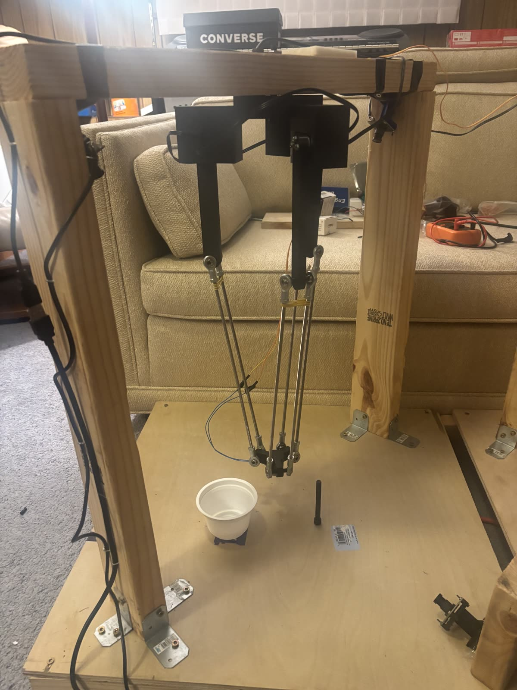
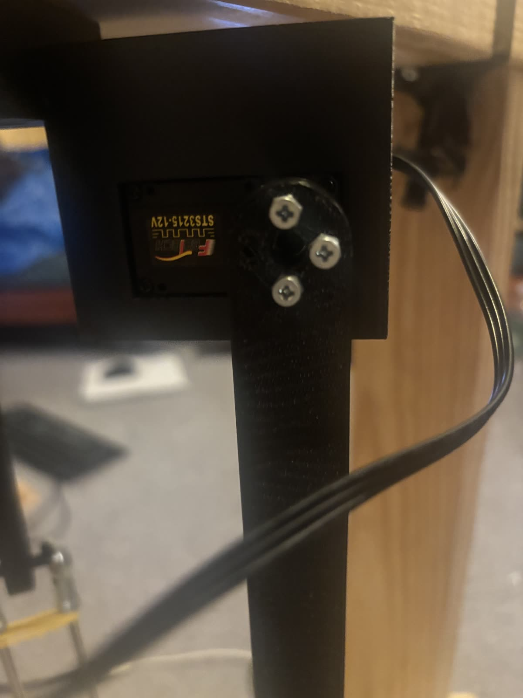
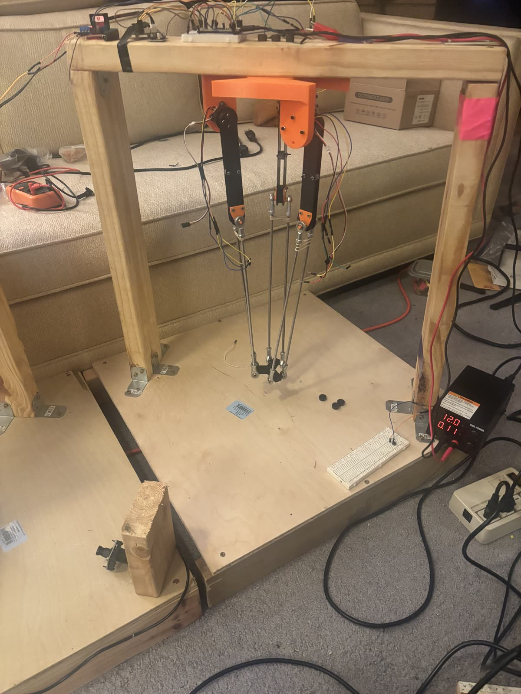
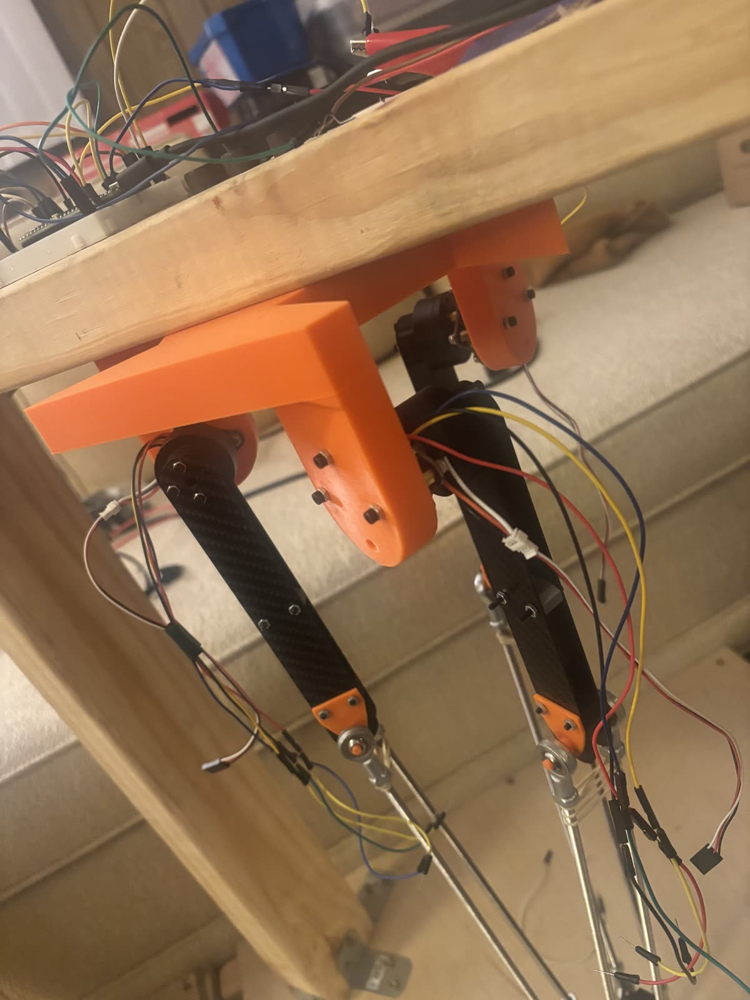
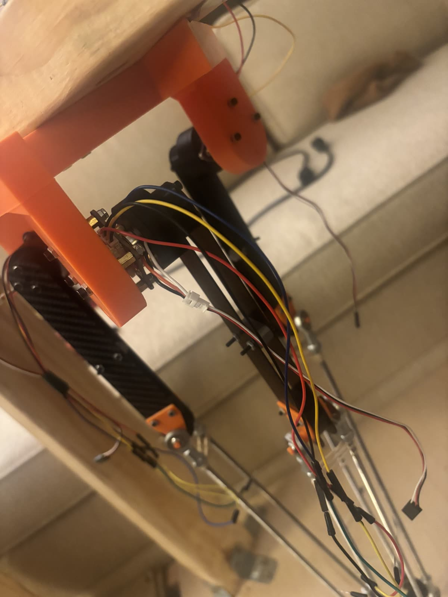

# Photos

| | |
|---|---|
|  | Follower robot (left, does the task) and leader arm (right, moved by hand) |
|  | Follower: three STS3215 servos at the top, parallelogram rods down to the electromagnet end effector; cup and bolt on the table |
|  | Follower shoulder: Feetech STS3215 (12 V) servo and upper arm |
|  | Leader arm in its frame, with the electronics on top |
|  | Leader shoulders: printed mounts with an AS5600 magnetic encoder on each joint |
|  | Leader joint close-up |
